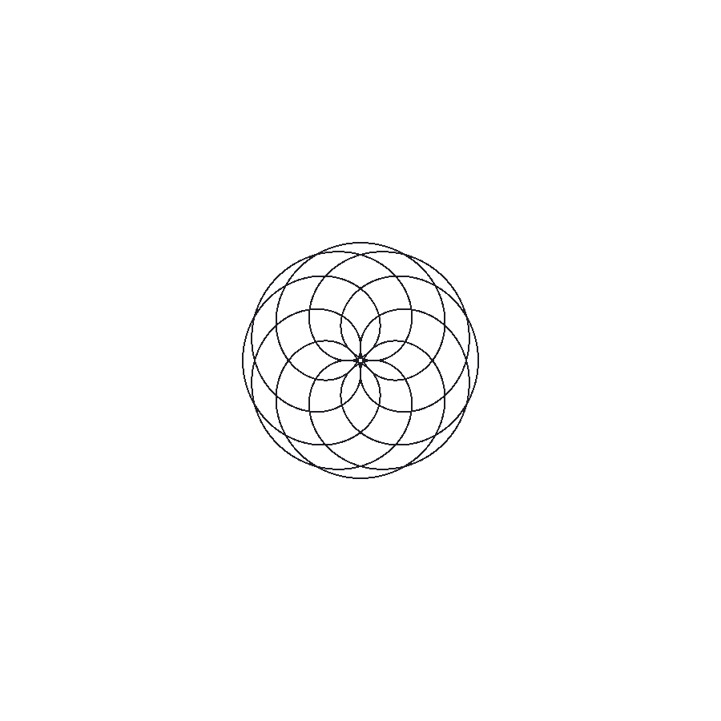

# SpiroGraf

Spirals, fractals, or grafitti ?

Welcome to [SpiroGraf](https://jdalal.dev/spirograf/spirograf.html "SpiroGraf Live Demo") !

SpiroGraf is a tool for exploring hypotrochoids.

Inspired by spiderwebs and patterns, SpiroGraf enables users to adjust properties of the stationary and rotating circles in order to visualize and generate the resulting figures.

***

## Notes

Per wikipedia: A hypotrochoid is a roulette traced by a point attached to a circle of radius *r* rolling around the inside of a fixed circle of radius *R*, where the point is a distance *d* from the center of the interior circle.

***

## Technologies

SpiroGraf is intentionally built with the simplest of technologies:

* HTML
* JavaScript
* CSS/SCSS

***

## Features

* Adjustable properties:
    * Radii for the stationary and rotational circles
    * Distance of the fixed point
    * Speed of drawing generation
    * Line color
* Control options:
    * Start and stop generation
    * Reset properties to default values
* Ability to download picture (PNG) of the generated figure

***

## Interface

The interface is designed to be clean, simple, and intuitive. With the goal of stimulating an exploratory mindset:

<br />

***

## Example: Figure Generation

<br />

## Example: Resulting Figures

<br />

***

## Code Snippets

The following sequence of code illustrates the steps taken to resize the html canvas, where the circles are displayed.
Since the canvas width and height are set in pixels, the entire canvas must be redrawn whenever the window fits within the allocated window widths and triggers a resize.

<br />

The original code for triggering a resize upon encountering a new window width:
```javascript
windowMiniResize = windowMatchMini => {
    if (windowMatchMini.matches) {
        resize(270);
    };
};
let windowMatchMini = window.matchMedia("( max-width: 366px )");
windowMiniResize(windowMatchMini);
windowMatchMini.addListener(windowMiniResize);

windowSmallResize = windowMatchSmall => {
    if (windowMatchSmall.matches) {
        resize(300);
    };
};
let windowMatchSmall = window.matchMedia("( min-width:367px ) and (max-width: 631px)");
windowSmallResize(windowMatchSmall);
windowMatchSmall.addListener(windowSmallResize);

windowMediumResize = windowMatchMedium => {
    if (windowMatchMedium.matches) {
        resize(600);
    };
};
let windowMatchMedium = window.matchMedia("( min-width:632px ) and ( max-width: 969px )");
windowMediumResize(windowMatchMedium);
windowMatchMedium.addListener(windowMediumResize);

windowLargeResize = windowMatchLarge => {
    if (windowMatchLarge.matches) {
        resize(900);
    };
};
let windowMatchLarge = window.matchMedia("(min-width: 970px)");
windowLargeResize(windowMatchLarge);
windowMatchLarge.addListener(windowLargeResize);
```

<br />

Based on the above pattern, a consolidation of the repeated code results in a noticeable reduction in the total lines of code:
```javascript
// Resize responsive layout for canvases
let listenerMini, listenerSmall, listenerMedium, listenerLarge;
let windowMatches = {
    1: ["(max-width: 366px)", 270, listenerMini],
    2: ["(min-width:367px) and (max-width: 631px)", 300, listenerSmall],
    3: ["(min-width:632px) and (max-width: 969px)", 600, listenerMedium],
    4: ["(min-width: 970px)", 900, listenerLarge]
};
for ( windowMatch in windowMatches ) {
    let newSize = windowMatches[windowMatch][1];
    
    windowMatches[windowMatch][2] = window.matchMedia(windowMatches[windowMatch][0]);
    if (windowMatches[windowMatch][2].matches) { resize(newSize); };
    
    windowMatches[windowMatch][2].addListener( windowMatch => { if (windowMatch.matches) { resize(newSize); }; });
};
```

<br />

Similary, a helper function resizes the canvas and circle properties, and sets the default, mininum, and maximum values for the slider options:
```javascript
// HELPER resize responsive layout for canvas
resize = canvasSize => {
    setGlobals(canvasSize);

    let inputMappedToCircles = { 1: baseCircle, 2: rotatorCircle, 3: rotatingPoint };
    for (mappedPair in inputMappedToCircles) {
        document.getElementsByClassName("options-content-value-"+mappedPair.toString())[0].min = inputMappedToCircles[mappedPair].radiusMin;
        document.getElementsByClassName("options-content-value-"+mappedPair.toString())[0].max = inputMappedToCircles[mappedPair].radiusMax;
        document.getElementsByClassName("options-content-value-"+mappedPair.toString())[0].value = inputMappedToCircles[mappedPair].radius;
        document.getElementsByClassName("options-content-input-element-"+mappedPair.toString())[0].min = inputMappedToCircles[mappedPair].radiusMin;
        document.getElementsByClassName("options-content-input-element-"+mappedPair.toString())[0].max = inputMappedToCircles[mappedPair].radiusMax;
        document.getElementsByClassName("options-content-input-element-"+mappedPair.toString())[0].value = inputMappedToCircles[mappedPair].radius;
    };

    resetToggle();
    initDrawing();
};
```

<br />

Redrawing the canvas necessitates re-initializing the global canvas and circles properties, via a series of recalculations:
```javascript
// HELPER set globals
setGlobals = canvasSize => {
    canvasBase.width = canvasSize;
    canvasBase.height = canvasSize;
    canvasDrawing.width = canvasSize;
    canvasDrawing.height = canvasSize;

    defaultVals = { baseCircleRadius: canvasSize / 3, rotatorCircleRadius: Math.ceil(canvasSize / 9) - 1, rotatingPointRadius: canvasSize / 12, speedTime: 60 };
    baseCircle = { radius: defaultVals.baseCircleRadius, radiusMin: canvasSize / 6, radiusMax: canvasSize / 3, cx: canvasSize / 2, cy: canvasSize / 2 };
    rotatorCircle = { radius: defaultVals.rotatorCircleRadius, radiusMin: canvasSize / 30, radiusMax: canvasSize / 6 };
    updateRotatorCircle();
    rotatingPoint = { radius: defaultVals.rotatingPointRadius, radiusMin: canvasSize / 30, radiusMax: Math.floor(canvasSize / 4.5) };
};

updateRotatorCircle = () => rotatorCircle = { ...rotatorCircle, ...{ cx: baseCircle.cx + baseCircle.radius - rotatorCircle.radius, cy: baseCircle.cy } };
```

<br />

Based on the re-initialized circle properties, a new set of circles is drawn to the resized canvas via layered helper functions:
```javascript
// Draw initial circles
initDrawing = () => {
    time = 0;

    contextBase.clearRect(0, 0, canvasBase.width, canvasBase.height);

    drawArc(contextBase, baseCircle.cx, baseCircle.cy, baseCircle.radius, 0, textCol);
    drawArc(contextBase, rotatorCircle.cx, rotatorCircle.cy, rotatorCircle.radius, 0, textCol);

    let rotatingPointX = rotatorCircle.cx + rotatingPoint.radius;
    let rotatingPointY = rotatorCircle.cy;
    drawLine(contextBase, 1, rotatorCircle.cx, rotatorCircle.cy, rotatingPointX, rotatingPointY, textCol);
    drawArc(contextBase, rotatingPointX, rotatingPointY, 3, textCol, textCol);

    contextDrawing.restore();
    contextDrawing.clearRect(0, 0, canvasDrawing.width, canvasDrawing.height);
    contextDrawing.save();
    contextDrawing.beginPath();
    contextDrawing.translate(canvasBase.width / 2, canvasBase.height / 2);
};

// HELPERS canvas drawers

drawArc = (context, cx, cy, radius, fillCol = 0, strokeCol = 0) => {
    context.beginPath();
    context.arc(cx, cy, radius, 0, 2 * Math.PI);
    context.fillStyle = fillCol;
    if (fillCol !== 0) { context.fill(); };
    if (strokeCol !== 0) { context.strokeStyle = strokeCol; };
    context.stroke();
};

drawLine = (context, toggleBegin = 0, srcX = false, srcY = false, destX, destY, strokeCol = 0) => {
    if (toggleBegin !== 0) { context.beginPath(); };
    if (srcX !== false) { context.moveTo(srcX, srcY); };
    context.lineTo(destX, destY);
    if (strokeCol !== 0) { context.strokeStyle = strokeCol; };
    context.stroke();
};
```

<br />

Upon clicking the start button, the drawing runs by recalculating a new coordinate position as a function of each time step, which is a resettable internal counter variable:
```javascript
// Draw rotating circle and corrresponding point
startDrawing = () => {
    if (running) {
        let rotatorAngle = (((2 * Math.PI) / speed.time) * time++);
        let rotatingPointX = rotatingPoint.radius * Math.cos((baseCircle.radius - rotatorCircle.radius) / rotatorCircle.radius * rotatorAngle);
        let rotatingPointY = 0 - rotatingPoint.radius * Math.sin((baseCircle.radius - rotatorCircle.radius) / rotatorCircle.radius * rotatorAngle);

        contextBase.clearRect(0, 0, canvasBase.width, canvasBase.height);
        drawArc(contextBase, baseCircle.cx, baseCircle.cy, baseCircle.radius, 0, textCol);
        
        contextBase.save();
        contextBase.translate(canvasBase.width / 2, canvasBase.height / 2);
        contextBase.rotate(rotatorAngle);
        contextBase.translate(baseCircle.radius - rotatorCircle.radius, 0);
        drawArc(contextBase, 0, 0, rotatorCircle.radius, 0, textCol);
        drawLine(contextBase, 1, 0, 0, rotatingPointX, rotatingPointY, textCol);
        drawArc(contextBase, rotatingPointX, rotatingPointY, 3, textCol, textCol);
        contextBase.restore();

        contextDrawing.save();
        contextDrawing.rotate(rotatorAngle);
        contextDrawing.translate(baseCircle.radius - rotatorCircle.radius, 0);
        drawLine(contextDrawing, 0, false, false, rotatingPointX, rotatingPointY, color);
        contextDrawing.restore();

        window.requestAnimationFrame(startDrawing);
    };
};
```

***

## TODO

* Epitrochoid
* Color gradients
* Instructions popup
* Pixel smoothing
* Alternate base shapes
* ~~Responsive layout~~
