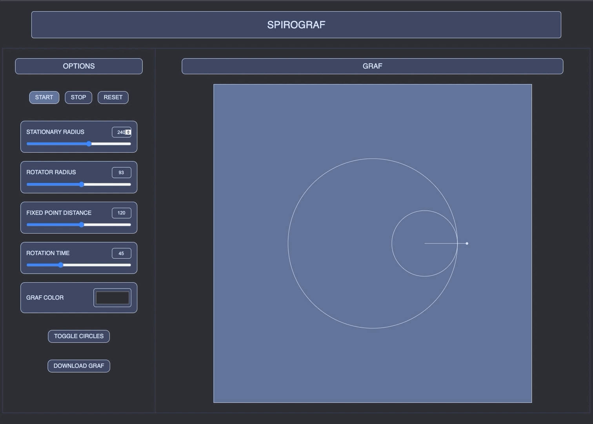

# SpiroGraf

Spirals, fractals, or grafitti ?

Welcome to [SpiroGraf](https://jdalal.dev/spirograf/spirograf.html "SpiroGraf Live Demo") !

SpiroGraf is a tool for exploring hypotrochoids.

Inspired by spiderwebs and patterns, SpiroGraf enables users to adjust properties of the stationary and rotating circles in order to visualize and generate the resulting figures.

***

## Notes

Per wikipedia: A hypotrochoid is a roulette traced by a point attached to a circle of radius *r* rolling around the inside of a fixed circle of radius *R*, where the point is a distance *d* from the center of the interior circle.

SpiroGraf is best viewed on larger resolution screens.
***

## Technologies

SpiroGraf is intentionally built with the simplest of technologies:

* HTML
* JavaScript
* CSS/SCSS

***

## Features

* Adjustable properties:
    * Radii for the stationary and rotational circles
    * Distance of the fixed point
    * Speed of drawing generation
    * Line color
* Control options:
    * Start and stop generation
    * Reset properties to default values
* Ability to download picture (PNG) of the generated figure

***

## Interface

The interface is designed to be clean, simple, and intuitive. With the goal of stimulating an exploratory mindset.
 

 

***

## Examples

### Figure Generation

 

 

### Resulting Figures

 

 

***

## Code Snippets

* Canvas utility functions
* Dynamic update utility function

***

## TODO

* Epitrochoid
* Color gradients
* Instructions popup
* Pixel smoothing
* Alternate base shapes
* Mobile layout
